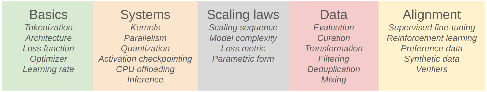
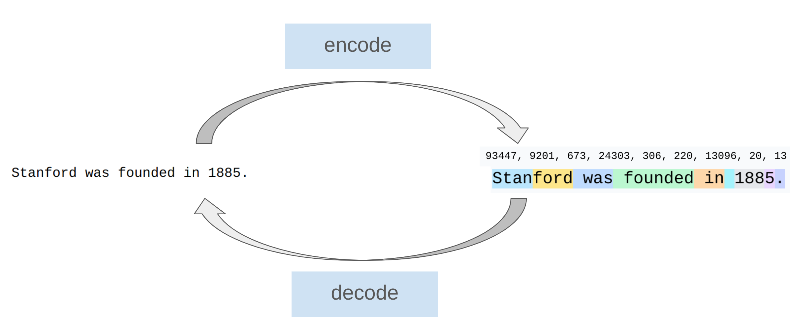
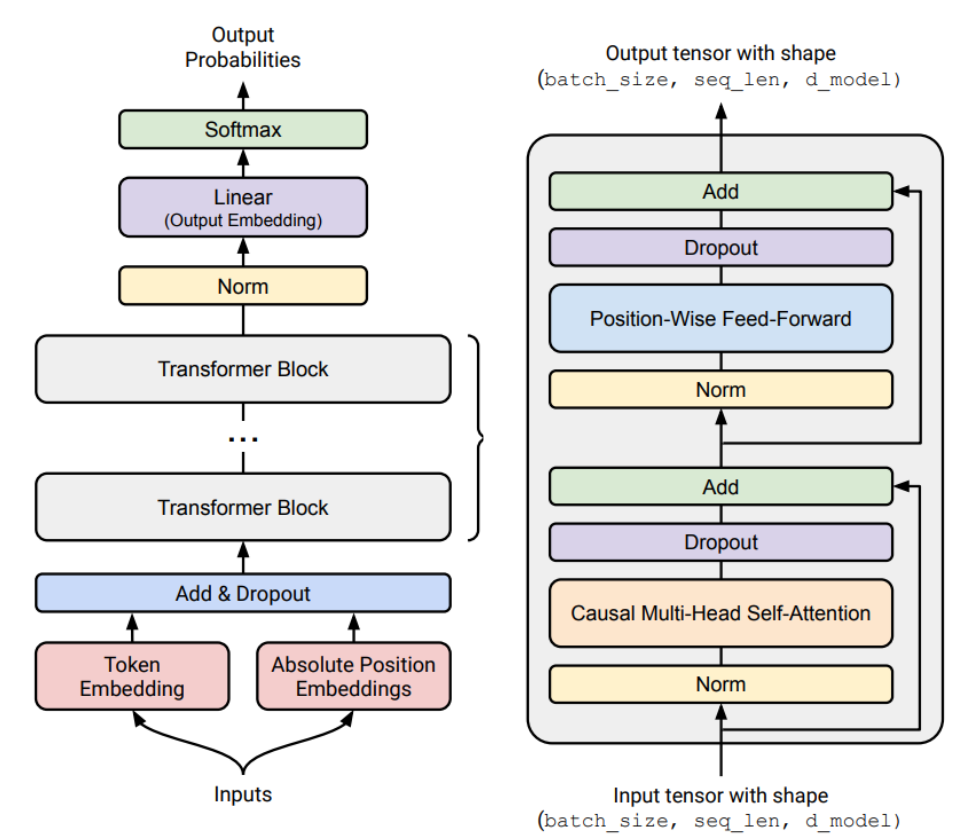
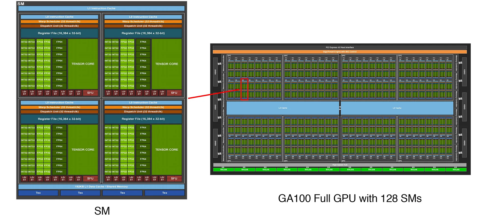
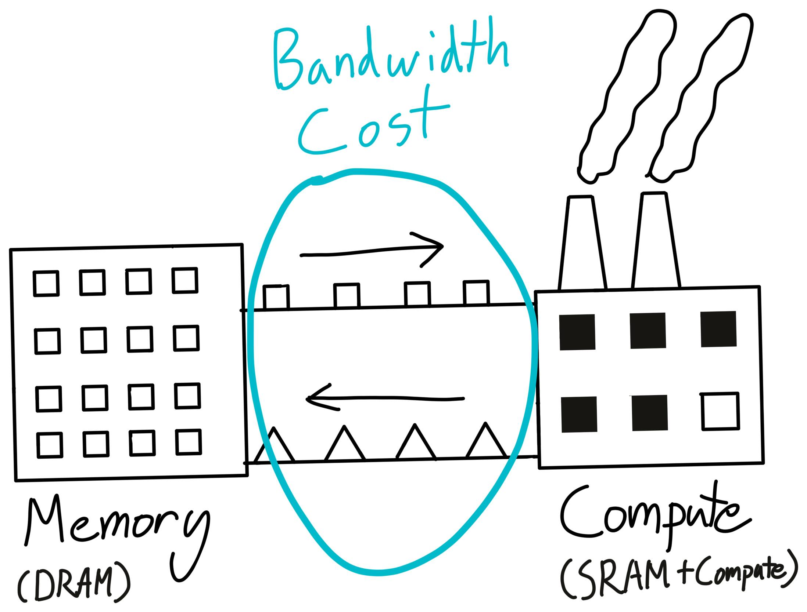
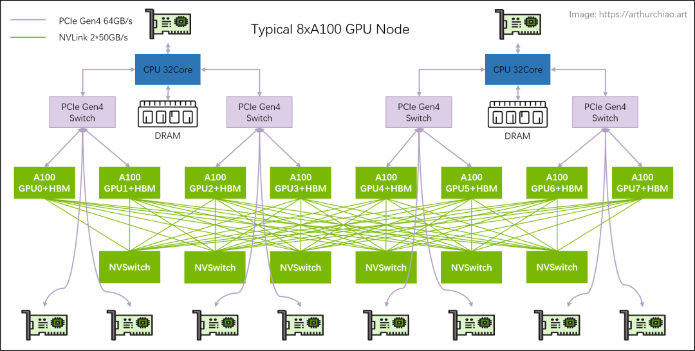
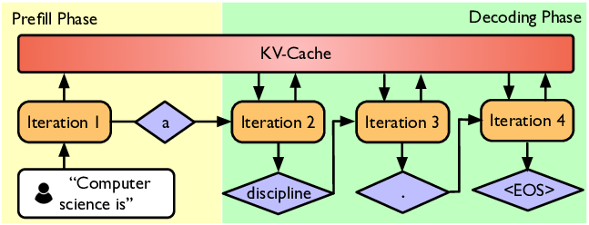
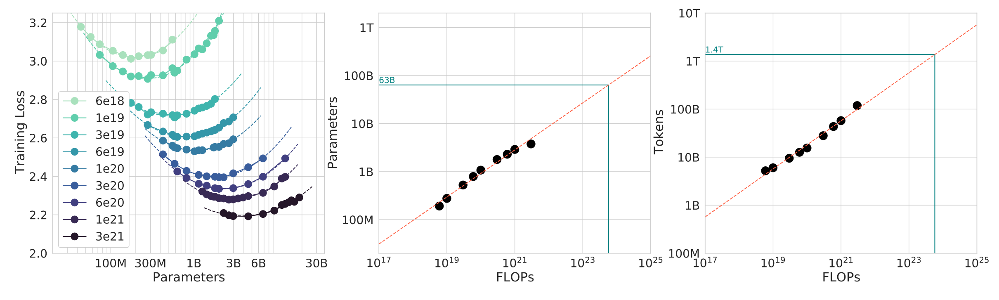

# Overview, tokenization

[Overview、tokenization课件地址](https://stanford-cs336.github.io/spring2025-lectures/?trace=var%2Ftraces%2Flecture_01.json&amp;step=146)

---

> [!Overview] 💡 Overview
> 本节课介绍了 CS336 的整体课程动机、课程内容与结构，系统性概览从语言模型基础实现（tokenization、Transformer、训练），到系统优化（kernel、并行、推理）、缩放定律、数据构建与评测，以及模型对齐（SFT、DPO、GRPO） 的完整语言模型构建流程。
>
> 最后以Tokenization作为第一个具体技术切入点

---

# 1. 这门课为什么存在（Why CS336）

**<u>这门课为什么存在：</u>**

- **研究者与底层的技术越来越脱节**

  - ​**8 年前**：研究者自己实现并训练模型
  - ​**6 年前**：下载 BERT 微调
  - **今天**：直接 prompt GPT-4 / Claude / Gemini
- 前沿研究仍然需要**撕开整套技术栈**

  > **Full understanding** of this technology is necessary for **fundamental research**
  >

**<u>但现实是：前沿模型不可复制</u>**

- GPT-4：\~1.8T 参数，\~\$100M 训练成本
- xAI：20 万张 H100
- 没有架构、数据、训练细节
- **More is different**：

  - 小模型（\<1B）≠ 大模型行为

**<u>通过这门课可以学到什么：</u>**

- ​**Mechanics**: how things work (什么是 Transformer, 模型如何并行使用 GPU)
- **Mindset**: 最大限度发挥硬件性能，认真考虑scaling laws
- ​**Intuitions**: 什么样的 data 和 modeling decisions 会有更好的结果

**<u>The bitter lesson</u>**

- 错误理解: 规模才是一切，算法不重要
- **正确理解：能随规模扩展的算法才重要**

  > **accuracy = efficiency × resources**
  >

---

# 2. 课程整体结构

**<u>课程目标</u>**

> **Everything is about efficiency**

**<u>课程结构</u>**



## 2.1 Basics

### 2.1.1 Tokenization

目标：string ↔ token ids



### 2.1.2 Architecture

起点：原始 Transformer



重要变体（后续都会用到）：

- 激活：ReLU, SwiGLU
- 位置编码：Sinusoidal, RoPE
- 归一化：LayerNorm, RMSNorm
- Pre-norm vs Post-norm
- Attention：

  - full
  - sliding window
  - GQA / MLA
- MoE
- State-space models（Hyena）

### 2.1.3 Training

- Optimizer：AdamW / Muon / SOAP
- LR schedule：cosine / WSD
- Batch size（critical batch size）
- 正则：dropout / weight decay
- 超参：grid search

### 2.1.4 Assignment 1

[[GitHub\]](https://github.com/stanford-cs336/assignment1-basics)   [[PDF\]](https://github.com/stanford-cs336/assignment1-basics/blob/main/cs336_spring2025_assignment1_basics.pdf)

实现：

- BPE tokenizer
- Transformer
- Cross-entropy
- AdamW

## 2.2 System

### 2.2.1 Kernels

				

写 kernel：

- CUDA
- Triton
- CUTLASS

‍

### 2.2.2 Parallelism



工具：

- all-reduce
- shard parameters / activations / optimizer states

并行方式：

- Data
- Tensor
- Pipeline
- Sequence

‍

### 2.2.3 Inference



总推理算力 \> 总训练算力

两阶段：

- ​**Prefill**：算力瓶颈
- ​**Decode**：显存瓶颈

### 2.2.4 Assignment 2

 [[GitHub from 2024\]](https://github.com/stanford-cs336/spring2024-assignment2-systems)   [[PDF from 2024\]](https://github.com/stanford-cs336/spring2024-assignment2-systems/blob/master/cs336_spring2024_assignment2_systems.pdf)

- Triton 写 RMSNorm
- DDP
- optimizer sharding
- profiling

‍

## 2.3 Scaling Laws

目标：进行小规模实验，预测大规模超参数/损失

问题：FLOPs 固定时，是加模型还是加数据？



### 2.3.1 Assignment 3

 [[GitHub from 2024\]](https://github.com/stanford-cs336/spring2024-assignment3-scaling)   [[PDF from 2024\]](https://github.com/stanford-cs336/spring2024-assignment3-scaling/blob/master/cs336_spring2024_assignment3_scaling.pdf)

- 小规模跑实验
- 拟合 scaling law
- 预测大模型超参
- 在 FLOPs 预算下最小 loss

‍

## 2.4 Data

> **我们希望语言模型具备什么能力？**

能力目标 → 决定数据选择与配比

### 2.4.1 Evaluation：如何判断模型好不好

- ​**Perplexity**：基础 LM 指标
- ​**Benchmarks**：MMLU / HellaSwag / GSM8K
- ​**Instruction following**：AlpacaEval / IFEval / WildBench
- ​**Test-time compute**：CoT / ensembling
- ​**LM-as-a-judge**：评估开放式生成
- ​**Full system**：RAG / agents

### 2.4.2 Data curation

- 数据不是天然存在的
- ​**来源**：Web / books / arXiv / GitHub
- ​**法律问题**：fair use？数据授权（如 Reddit）
- ​**格式**：HTML / PDF / repo（非纯文本）

### 2.4.3 Data processing

- ​**Transformation**：HTML/PDF → text（保留内容与结构）
- ​**Filtering**：质量 + 安全（分类器）
- ​**Deduplication**：省算力、防记忆（Bloom / MinHash）

### 2.4.4 Assignment 4

[[GitHub from 2024\]](https://github.com/stanford-cs336/spring2024-assignment4-data)   [[PDF from 2024\]](https://github.com/stanford-cs336/spring2024-assignment4-data/blob/master/cs336_spring2024_assignment4_data.pdf)

- Common Crawl → text
- 分类器过滤
- 去重
- token budget 内最小 perplexity

## 2.5 Alignment

**定位**

- Base model：只擅长 next-token prediction

- Alignment：让模型**可用、可控、可部署**

### 2.5.1 Supervised Fine-Tuning (SFT)

- ​**数据**：(prompt, response)
- ​**来源**：人工标注
- ​**直觉**：base model 已有能力，只需“引导显化”
- ​**目标函数**：

  $$
  \max \; p(\text{response} \mid \text{prompt})
  $$

‍

### 2.5.2  Learning from Feedback

**动机**

- 提升 instruction-following
- 避免昂贵人工标注

### 2.5.3 Assignment 5

 [[GitHub from 2024\]](https://github.com/stanford-cs336/spring2024-assignment5-alignment)   [[PDF from 2024\]](https://github.com/stanford-cs336/spring2024-assignment5-alignment/blob/master/cs336_spring2024_assignment5_alignment.pdf)

- 实现 **SFT**
- 实现 **DPO**
- 实现 **GRPO**

---

# 3. Tokenization

[Tiktokenizer体](https://link.zhihu.com/?target=https%3A//tiktokenizer.vercel.app/%3Fencoder%3Dgpt2)

## 3.1 定义

- **Tokenizer**：  
  strings ↔ token indices

  
- 模型对 **token序列** 建模，而不是对字符串建模
- **Vocabulary size** \= token 种类数
- **Compression Ratio**

  $$
  \text{compression ratio} = \frac{\#\text{bytes}}{\#\text{tokens}}
  $$

  - 每个 token 平均覆盖多少个 byte
  - 数值越大 → token 越“信息密集” → 序列越短 → attention 越省

‍

## 3.2 常见Tokenization方案

### 3.2.1 Character-based tokenization

```python
    assert ord("a") == 97
    assert ord("🌍") == 127757

    assert chr(97) == "a"
    assert chr(127757) == "🌍"
```

- 单位：Unicode code point
- ​**优点**：可逆、简单
- ​**问题**：

  - voca 极大（\~150K）
  - 大量稀有字符，效率低

### 3.2.2 Byte-based tokenization

```python
    assert bytes("a", encoding="utf-8") == b"a"

    assert bytes("🌍", encoding="utf-8") == b"\xf0\x9f\x8c\x8d
```

- 单位：UTF-8 bytes（0–255）
- ​**优点**：

  - vocab 固定 256
  - 无 OOV (Out-Of-Vocabulary)
- ​**问题**：

  - 序列极长（compression ratio \= 1）
  - attention 计算开销大

### 3.2.3 Word-based tokenization

- 单位：词或正则切分片段
- ​**问题**：

  - 词表巨大
  - 稀有词多
  - OOV / UNK 破坏建模与 perplexity
  - vocab size 不固定
- ❌ 不适合 LLM

### 3.2.4 Byte Pair Encoding (BPE)

**<u>核心思想</u>**

- 统计驱动的子词建模
- 高频字符序列 → 合并为一个 token
- 低频序列 → 保持拆分

**<u>BPE 训练</u>**

1. 初始 token：**UTF-8 bytes**
2. 统计相邻 token pair 频率
3. 合并出现次数最多的 pair
4. 重复若干次（num\_merges）

**<u>BPE 表示</u>**

- **vocab**：token id → bytes
- **merges**：(id₁, id₂) → new\_id

‍
